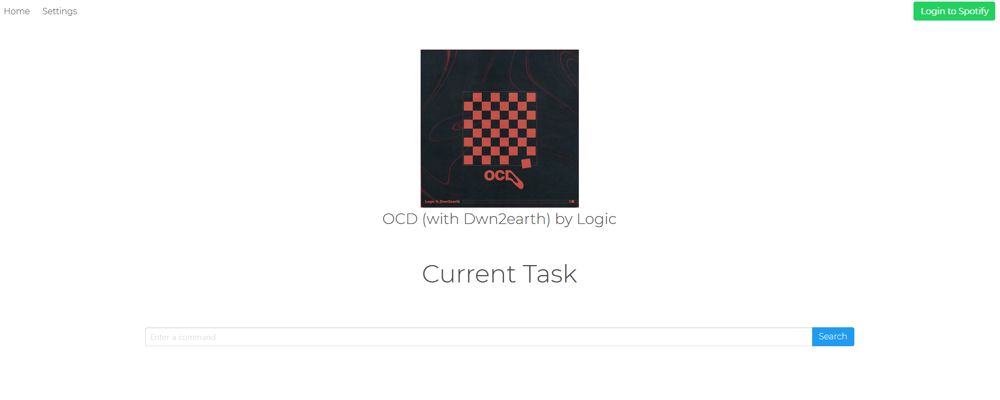

[](https://travis-ci.org/JackGoldsworth/Vision2)
[](https://sonarcloud.io/dashboard?id=me.jackgoldsworth.vision)

# Vision 2
Vision 2 is a home automation tool with a web app interface built with Spring Boot and React. The name comes from the original version of vision that I made a couple years back, which was based in Python and had no interface other than the command line and voice.

### Current UI


## What can be done:
- [x] User various functions of the spotify API
- [x] Use text to interact with the assistant.
- [ ] Use voice to interact with the assistant.
- [ ] Open and close user programs.
- [ ] Interface with lights and smart plugins (Not sure how possible)

## Tutorial:
Once a build is available, all you need to do is go into the cmd and type
```java -jar vision.1.0-all.jar```
and that should start a the web app on ```localhost:8080/``` (Will change the port later).
